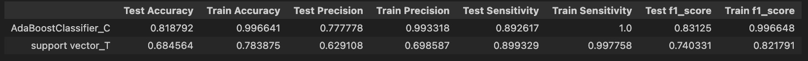
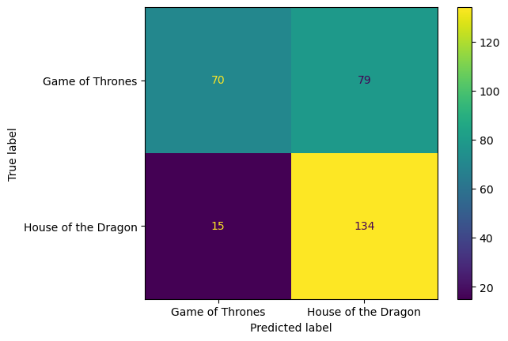

#  Project 3: Web APIs & NLP
#### Introduction
This is project 3 of of the General Assembly Data Science Immersive course. The objective of this project is to demostrate the data collection and Classification model. The outcome of the project is to predict which one of two sub-reddit is, from content (text). This project has chosen "Game of Thrones" and "House of the dragon" sub-reddit to be subject.

#### Business problem
One of the greatest TV series of all time, "Game of thrones". The serie finale was in 2019. To continue on its success, the studio release the prequel "House of the dragon" in 2022. Game of thrones subreddit used to be on fire during the show was on air and the popularity has dropped once the time goes by.The same popularity happened to House of the dragon too. 

Because these two shows are basically in the same universe. Many of Game of thrones fans sometime create the post in House of the dragon subreddit, due to more recent of the show. As the moderator of these two subreddits, I want to develope tool to check if post is in the right subreddit.

#### Data collection
The data is collected via reddit API. The goal is to obtain around 7,5000 post for each subreddit, total 15,000 posts. The data is collected in a list of dictionary. Then convert to .csv file, so they're easily transfer and used in the next process.

#### Data cleansing
From both of subreddit, I managed to collect 14,701 posts, unfortunately out of those posts, 12,808 of them are duplicated title. Now we only have 1,893 posts left. This mean that there are only 1,893 posts total for these 2 subreddits. 

Next I checked for null value. Another 702 posts have no content (null on selftext). Now the usuable data is 1,191 posts left. I selected 3 columns to be used for model training, which are explained in the data dictionary below. The subreddit of subreddit is converted from "gameofthrones" to 1 and from "houseOfthedragon" to 0, which to be used as class for the prediction.

Column|Data type|Description|
|---|---|---|
Subreddit|Boolen|1 is Game of thrones, 0 is House of the dragon
Title|string|Title of the post
Seltext|string|Content of the post

X is set to be value of column 'title' and 'selftext'.
y is subreddit.
Then split to Train-Test dataset for train and evaluation

#### Exploratory and Data Analysis
The baseline score for 2 subreddit is looking good, almost 50-50.

Next, explore and try to extract feature from unstructured text using CounterVectorized on both columns of X. The result shows 12,046 features in total. Then I query for the top 100 most common word, aiming to find the unique word of each shows, and include those words into stop words. 

Apply same method to TfidVectorized. and found that the top words using TfidVectorized are subset of top words using CounterVectorized. Now I have a list of custom stop word, to be added to default 'english'.

#### Model Building and optimization

The strategy is set to be in 2 steps
Step 1:
Use CounterVectorized and TfidVectorized together with pipeline to 2 set of 7 models: 
- Logistic Regression
- kNN Classification
- Naive Bayes
- Bagging
- AdaBoost
- Support Vector Classification
Ending up with 14 models. Each model will also be used the Gridsearch to look for the best of 'max_df', 'min_df', and 'max_depth'. Then pick the 2 models. 1 with least overfitting, and another is the best F1_test score. 

Step 2:
The 2 models will be further optimized by adding custom stop word, and Gridsearch on the best paramenter for of the model. Then select the model with best performance

Result
Step 1:
AdaBoost model with CounterVectorized is the one with the least overfitting and SVC with TfidVectorized is the one with the best f1 score on test data

all result table:

selected model:

Step 2:
optimize further by tuning parameter and added the custom stop words

#### Conclusion

After optimized both model, I'd select SVC. It is less overfitting, even through the score across the board is less. SVC has 3,168 features from the initial 12,046 features.

The total test data of 298 posts, the model prediction performance:
- Accuracy for subreddit is 78%
- Precision is 63%
- Sensitivity is 90%
- F1 score is 74%

It is better than baseline

